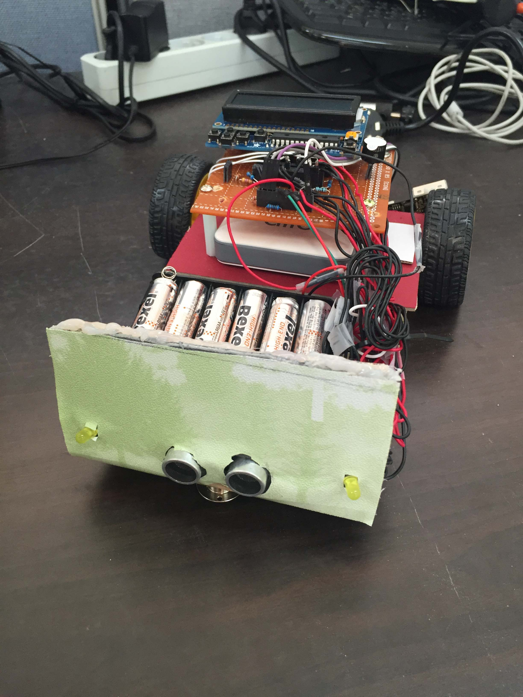

# Arduino DoorLock project  
## 여담
1학년 1학기를 마치고 2년간 중국에서 유학을 한 뒤, 군대를 다녀와 3학년 2학기로 복학을 하였다.  
3학년 2학기를 힘겹게 다니고 겨울방학동안 C언어를 공부한 뒤 4학년 1학기에 처음으로 진행해본 프로젝트이다.  
개발 실력이 부족했지만 `IoT`에 관심을 갖게 되어 진행하게 되었고 통신을 `유선 시리얼 통신`으로 구현하였는데 `블루투스`나 `Wi-Fi`로 구현하지 못한 점이 아쉬웠다.  

## 프로젝트 명세
기존 일반 `도어락`을 분해, 개조한 뒤 `아두이노`와 연결하여 `지문 인식 모듈`을 추가하고 `스마트폰`과 연결하여 `App`을 통해 원격 제어도 가능하게 하는 프로젝트.  
`HW 개발`을 담당하였다.  

## 진행기간  
2015.03.11 ~ 2015.05.27

## 주요 기능
* **PIR 센서**  
`PIR 센서`를 통해 사용자가 접근할 경우 자동으로 `지문 인식 모듈`이 활성화된다.  

* **지문 인식 모듈**  
`지문 인식 모듈`에 사용자를 등록한다.  
`지문 인식 모듈`에 등록된 특정 사용자를 삭제한다.  
등록된 사용자를 인식한다.  

* **도어락 연동**  
`지문 인식 모듈`을 통해 등록된 사용자가 인식이 되면 `도어락`을 오픈하며 `초록 LED`가 점멸된다.  
등록되지 않은 사용자가 인식되면 `빨간 LED`가 켜진다.  
`지문 인식 모듈`이 처리중인 경우 `노란 LED`가 켜져있다.  

* **통신 구현**  
스마트폰과 `유선 시리얼`로 연결되어, 원격 오픈과 사용자 관리에 대한 통신을 하여 처리한다.  
